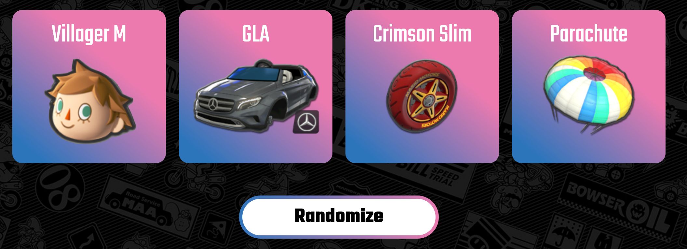

<h1 align="center">Mario Kart 8 DX Tools</h1>
<h3 align="center">
	[Website Link](https://mk8dx-tool.glitch.me/)
</h3>

This is a basic tool created to make Mario Kart 8 Delux a bit more fun for everyone. The kart randomizer makes games more interesting when playing with friends, to keep the sessions going without getting too repetitive.
Example sets are also there to help out the worse players, get a bit of an advantage and level the playing field.
**Note:** The site is hosted for free on glitch.com so it will take a couple seconds to wake up when you launch it.

### Home Page
<p align="center">
	
</p>

### Randomizer
The randomizer chooses from all parts available in the game and generates a kartcode. Use these randomly generated sets to spice up your games and keep the fun coming!

<p align="center">
	
</p>

All imgs are double checked with an XMLHttp Request:
```javascript
function ImageExistance(imgName) {
	var http = new XMLHttpRequest(); 
	if (imgName.length === 0) { 
		p("No img found…");
		return null;
	} else { 
		http.open('HEAD', imgName, false); 
		http.send(); 
		if (http.status === 200) { return true }
		else { return false}
	}
}
```
So if you see any issues where an image doesn't load in, DM me and let me know!


### Example Sets
There are several generated sets to allow for people to try new things out in the game, and try and get better. It is always important to see what is good and inovate from there, so knock yourself out. It does take a couple seconds to load the images in, so reload the page and wait a second if you are experiencing issues.

<p align="center">
	
</p>

This uses a generator with text file input to make set creation easier for people. If you have any fun sets, let me know and I'll add them!

### Final Note
I haven't fixed all the CSS issues, so there will probably be visual issues that exist. Just add them as an issue on the repo if you see them and I'll fix it. I didn't use bootstrap for this project as I wanted to practice my CSS skills, so I expect plenty of issues…
